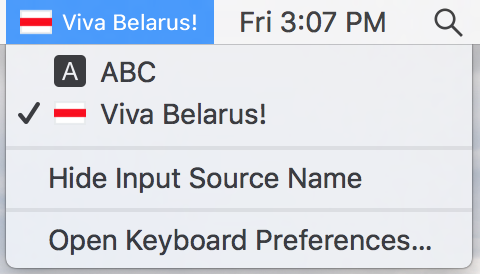

Viva Belarus!
Жыве Беларусь!
=================

That's a way to replace ugly bssr flag, which goes with macOS, with awesome white-red-white flag.
Спосаб замяніць уродлівы сцяг БССР, які ідзе разам з macOS, мілым сэрцу бел-чырвона-белым сцягам.

How to install
--------------

* Copy 'viva-belarus.bundle' into /Library/Keyboard\\ Layouts like this:

.. code-block::

    cd /tmp && git clone https://github.com/UladBohdan/viva-belarus-layout.git
    sudo cp -r viva-belarus-layout/viva-belarus.bundle /Library/Keyboard\ Layouts/

* Go to language preferences, press "+" button and add "Viva Belarus!" layout from "Belarusian" group.

Як усталяваць
--------------

* Скапіяваць 'viva-belarus.bundle' у /Library/Keyboard\\ Layouts наступным чынам:

.. code-block::

    cd /tmp && git clone https://github.com/UladBohdan/viva-belarus-layout.git
    
    sudo cp -r viva-belarus-layout/viva-belarus.bundle /Library/Keyboard\ Layouts/

* Зайсці ў моўныя налады (language preferences), націснуць "+" і дадаць "Viva Belarus!" раскладку з укладкі "Belarusian".

No more russian keyboard on your Mac!
Ніякіх больш расейскіх раскладак на Вашым Маку!
----------

- `alt-і` for 'и'
- `alt-shift-і` for 'И'
- `alt-ў` for 'щ'
- `alt-shift-ў` for 'Щ'
- `alt-'` for 'ъ'
